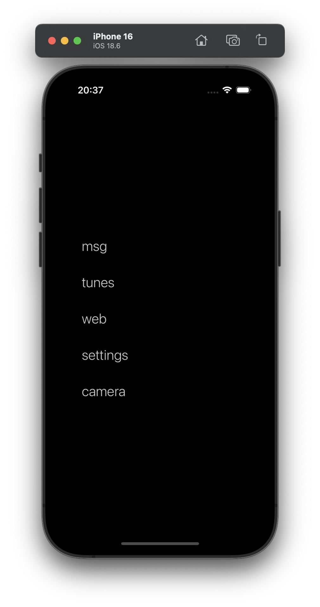

# DumbLauncher

This is a very dumb, minimalist iOS launcher written in swift.

  

## Features

- msg *opens whatsapp*
- tunes *opens spotify*
- web *opens safari*
- settings *opens settings*
- camera *opens camera*

### Notes

- The app definitions are currently hardcoded for my personal use.
- For the camera, due to iOS restrictions, it uses a custom shortcut that you need to add.
- Since you can't change springboot's behaviour without jailbreaking, you have to launch the launcher manually first (currently it is the only app on my home screen)
- This was just for me to learn a bit of swift.

### Todo

- Add configurable launcher items
- Add large widget for launching the launcher
- Figure out if we can workaround iOS restrictions better

